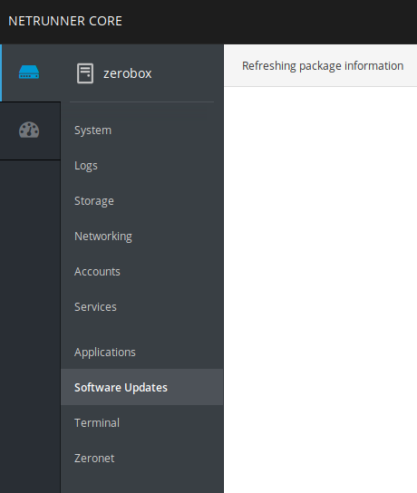

This section explain what to do right after plugged in your zerobox.

# Setup a safe browser on your device

On your computer, tablet or phone, we recommend to install [Firefox browser](https://www.mozilla.org/en-US/firefox/) to browse ZeroNet with.

# Access Cockpit

Cockpit allow you to manage ZeroNet from your device using its web interface. You can find it at [zerobox:9090](http://zerobox:9090)

## Log In

Enter the username choosen during the installation and the appropriate password. You also need to tick "Reuse my password for privileged tasks" for update.

## Update

You can update the Zerobox with the latest package from this section.

## Zeronet Section

The Zeronet section gives you control over the Zeronet program.

### Overview

The Zeronet section shows :
 * free space is available on the box
 * data being used by Zeronet (e.g 575.8 MiB)
 * Zeronet folder (e.g /opt/zeronet/ZeroNet-master)
 * current status

### Start and Stop Zeronet

In this module, it is possible to stop and start Zeronet by clicking on the "stop" button (showing when Zeronet is running) or the "start" button.

### Copy Zeronet

Your Zeronet datas can be copied to another device. It will allow you then to backup your datas or even start Zeronet from an external device.

### Start from external device

An external device can be plugged to the box and start Zeronet from it. Running Zeronet from an external drive will offer a better experience than running it directly from the box.
