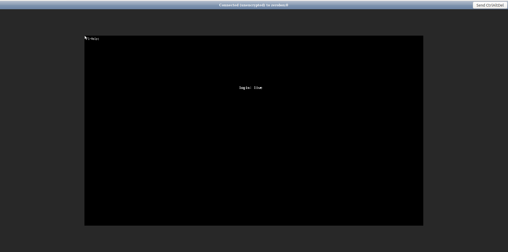
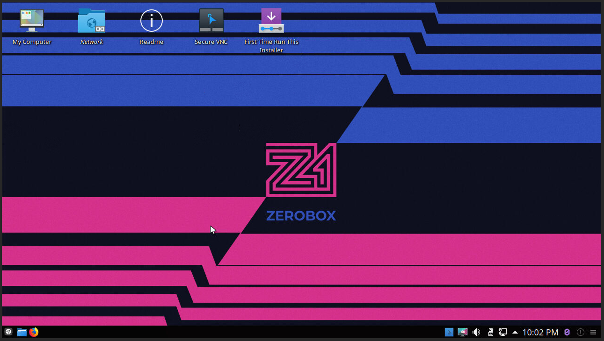
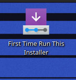
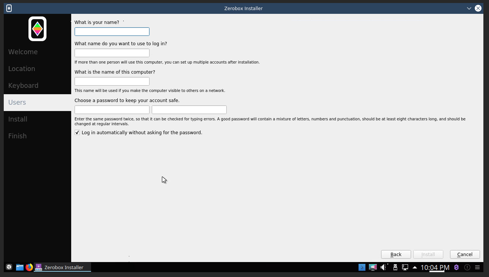
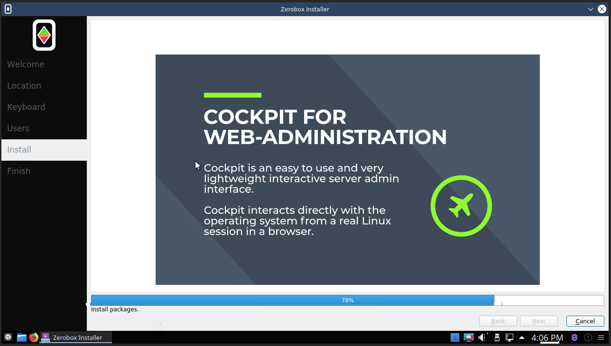

# Wizard

## Access the box

You can access the box graphic interface through [NoVNC](https://novnc.com/info.html).

To login use *live* user and *live* password.

You are now in the box.

## Start the wizard

You will need to start the installer wizard. It will guide you through the configuration of the box.

### Setup language and timezone

Setup the language and the timezone of your preference. It will also start ZeroNet with the choosen language if available.

### Setup the keyboard

The choice of the keyboard is important in case you want to plug a keyboard and a screen to directly access the box like a computer (without VNC).

### Access configuration

In the last part of the wizard, you can modify the name of your user and the password. You can also rename the machine, we recommend keeping **zerobox** if you have several boxes you ca pick a new name (e.g zerobox2).

Note : Please keep "Log in automatically without asking for the password" checked.

### Installation process

Once the configuration over the wizard will processed with the installation.

The installation can take up to 10 minutes. At the end the box will need to be restart.

You should wait a couple of minutes before trying to access it again.
