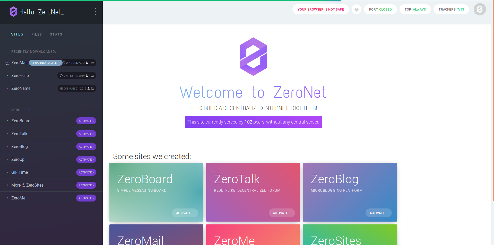
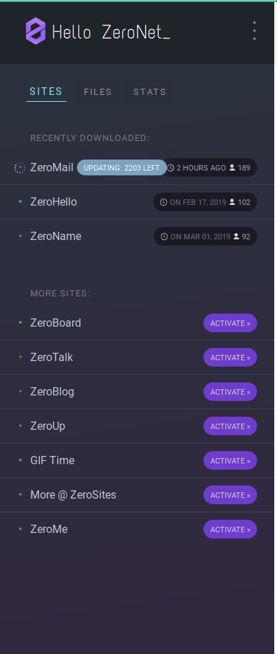
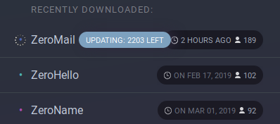
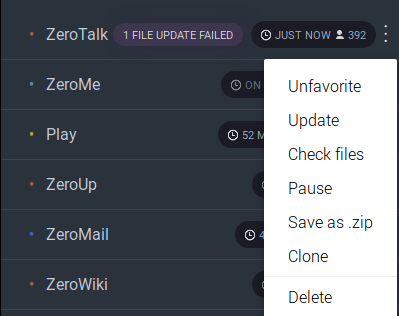
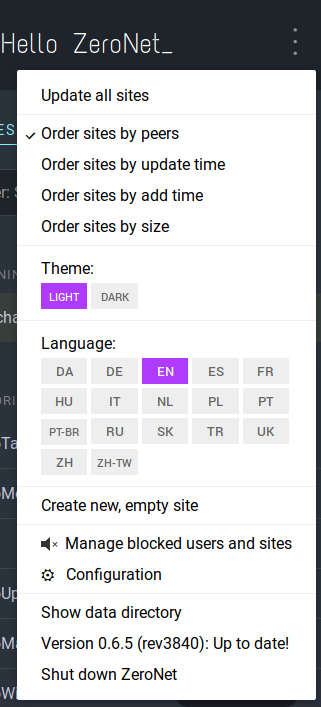
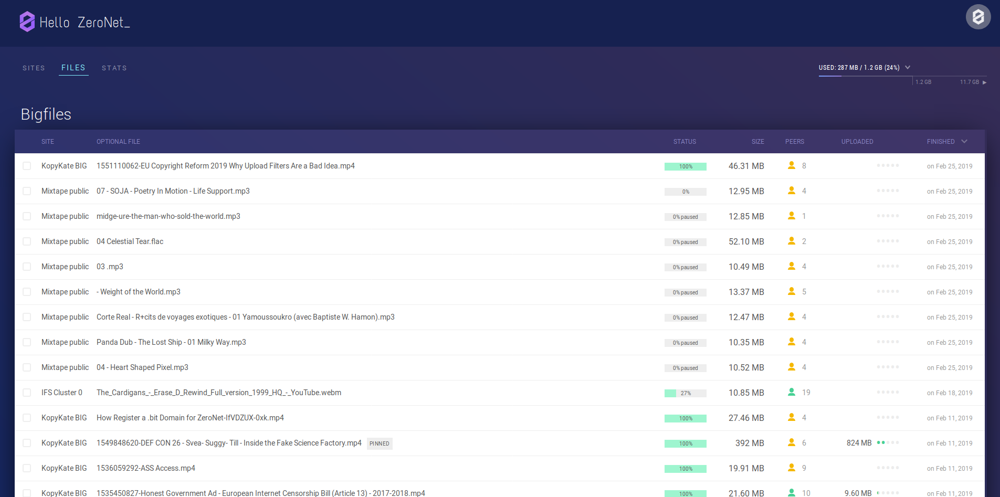
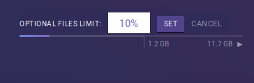
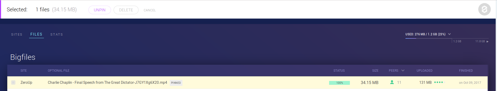
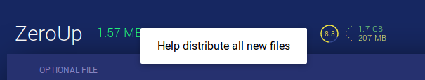
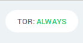

# Zeronet

You are now ready to access Zeronet.

## Accessing Zeronet

To access Zeronet you can access it at this address **zerobox/** (assuming you chose zerobox as the name of your box). It will give you access to Zeronet welcome page.

## Welcome page feature

This is Zeronet homepage, zeronet will open on it by default.

### Sites bar

On the left side you have a bar. It shows the sites that you have already downloaded (by default it comes with ZeroHello and ZeroName sites).

In the **More Sites** section, you can find demo sites that you can visit.

#### Sites downloaded

Next to the name, you have information on the site : numbers of peers (e.g 102) and last time updated (e.g Feb 17, 2019).

When Zeronet is currently updating a site you can follow its progress next to the name too.

#### Site Menu

You will also find a site menu that gives you access to the following actions :
* **Favorite/Unfavorite** - Quickly find your favorite sites or remove from your favorite
* **Update** - Look for update for the site
* **Check files** - Look at the files for this site and verify possible corrupted files
* **Pause** - Pause the updates for this site
* **Save as .zip** - Save the site in archive
* **Clone** - Clone this specific website (allow you to create your own version of it)
* **Delete** - Delete the website

#### Favorites sites

A list of bookmark site which will show at the top of the menu.

#### ZeroHello menu

This menu on ZeroHello page gives you access to some specific Zeronet functionalities.

* **Update all sites** - Shortcut to query for updates for all the sites you are currently seeding
* **Order sites by peers/update time/add time/size** - Orders sites in the side bar by numbers of peers, update time, add time or size
* **Theme Light/Dark** - Change the theme color for the ZeroHello page
* **Language** - Translate the Zeronet in the choosen language (will also load website in the selected language if available)
* **Create new, empty site** - Create a new empty site for you
* **Manage blocked users and sites** - Show you the list of blocked users and sites (see #name-of-the-section)
* **Configuration** - Access to configuration page (see #name-of-the-section)
* **Show data directory** - Open the Zeronet's data directory in your files explorer
* **Version 0.6.5 (rev3840): Up to date!** - Update button
* **Shut down ZeroNet** - Will shutdown Zeronet

#### Files

It is possible to visualize all the optional files that you are sharing in the **files** section from the ZeroHello page.

Those specific files are only downloaded when explicitly requested. They are files bigger than 1MB, they can be videos/audios/archive/etc...

On the top right you will find information on how much of your hard drive Zeronet will use (by default 10% of your free space).

The first section **BigFiles** show you a list of all the optional files available on your system.

You will find the following information :
* **Site** - The name of the site which host this big file
* **Optional File** - The name of the optional file; the `pinned` label inform you that they are going to be kept unless explicitly deleted by you. Otherwise a optional file can be removed from your system if your run out of space.
* **Status** - Show the pourcentage downloaded
* **Size** - The size of the file
* **Peers** - Numbers of known peers seeding this file
* **Uploaded** - Data uploaded to another peer
* **Finished** - The date when you it has been added

I you select a file a edit bar will show allowing you `pin/unpin` the file or to `delete` it from your system.

The others sections are dedicated to each sites you have visited. It gives you information for each specific site and even allow you to **help distributing all the new files**. It will automatically download all the newly uploaded files to help make then easily available to other peers.

Next to the name you also have a score indicating how much you downloaded vs uploaded. It gives an idea of your participation to the network.

#### Stats

### Tor

Zerobox has Tor already installed and start by default with it activated. You can verify that it is working if you see on the welcome page "TOR: Always".

